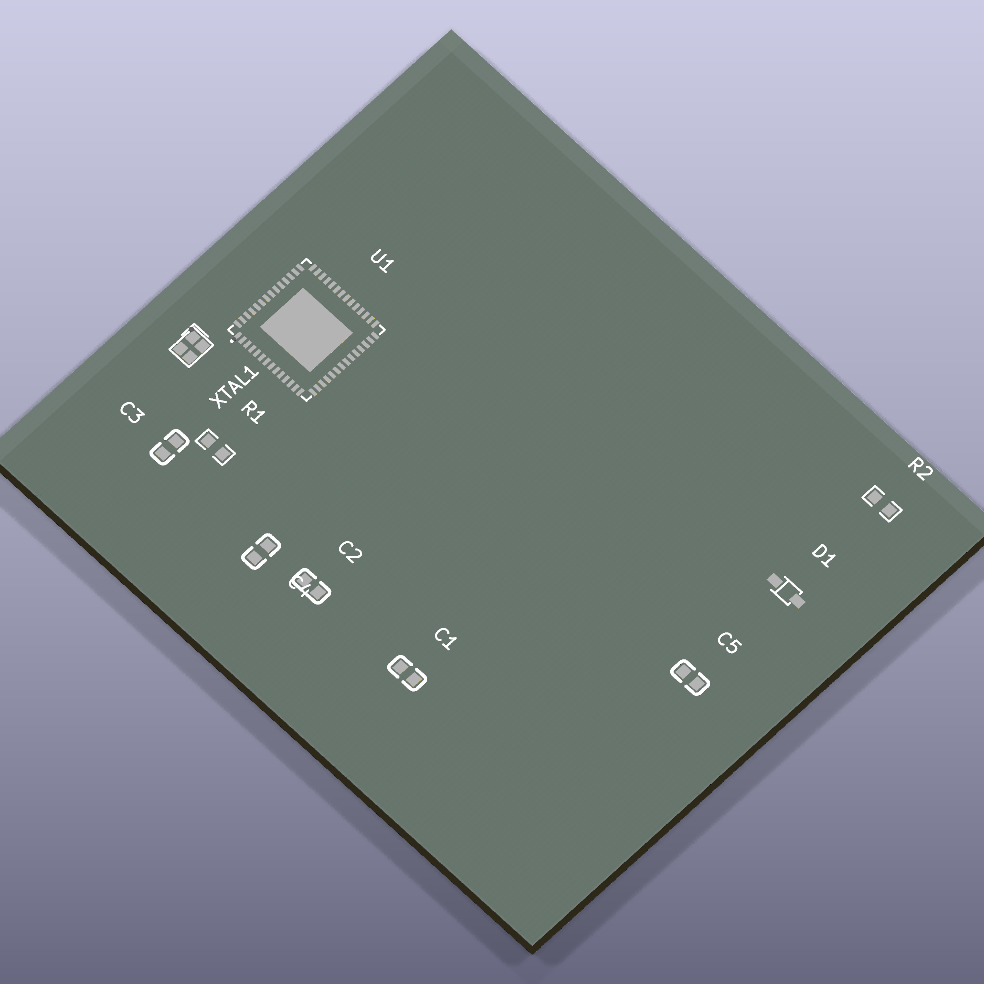

# bm9002a_56ilg

BM9002A-56ILG microcontroller

## Package Information

- Version: 0.1.0
- Total Modules: 1
- Author(s): Ruben Iteng
- License: MIT
- Homepage: https://github.com/ruben-iteng/ato-library

## Available Modules

### Module List

| Image | Module | Description |
|-------|--------|-------------|
|| cbm9002a_56ilg_reference_design | Reference design for the BM9002A_56ILG microcontroller. |
