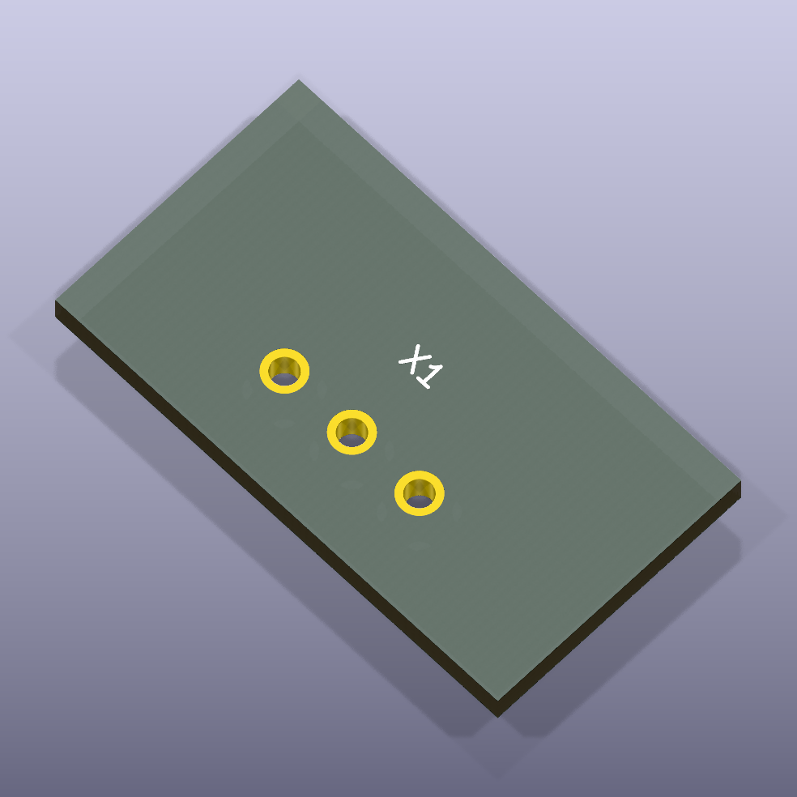
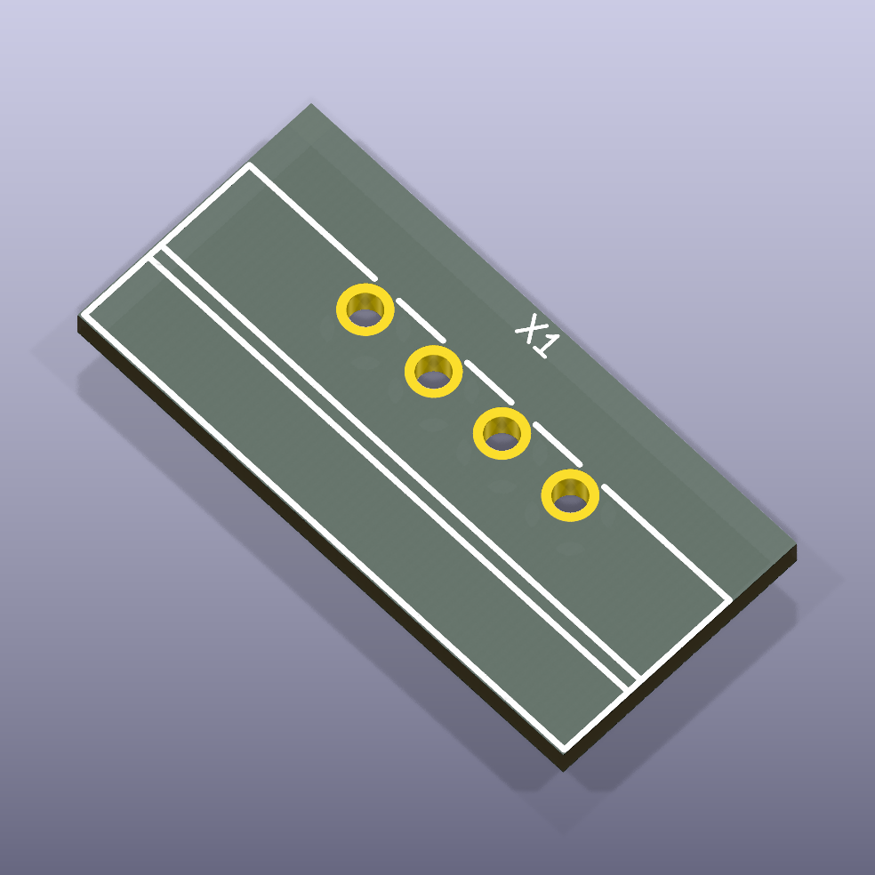
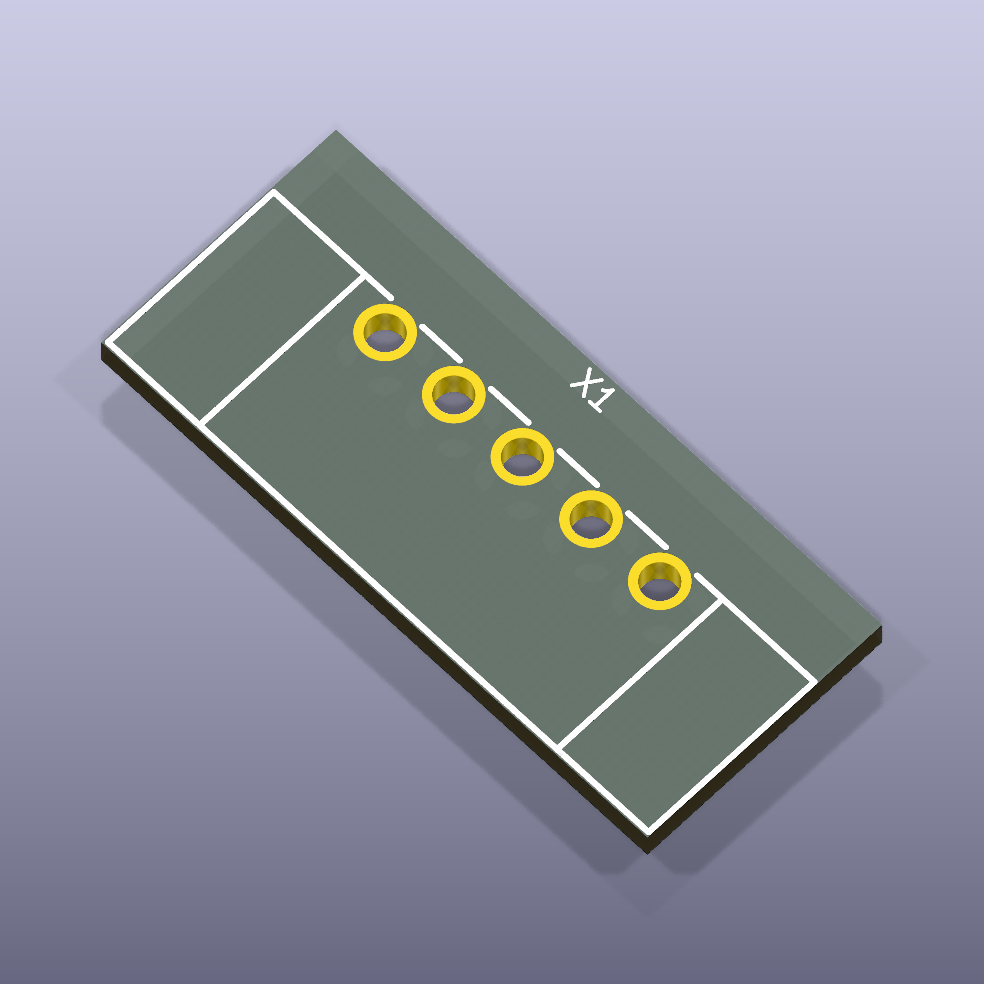
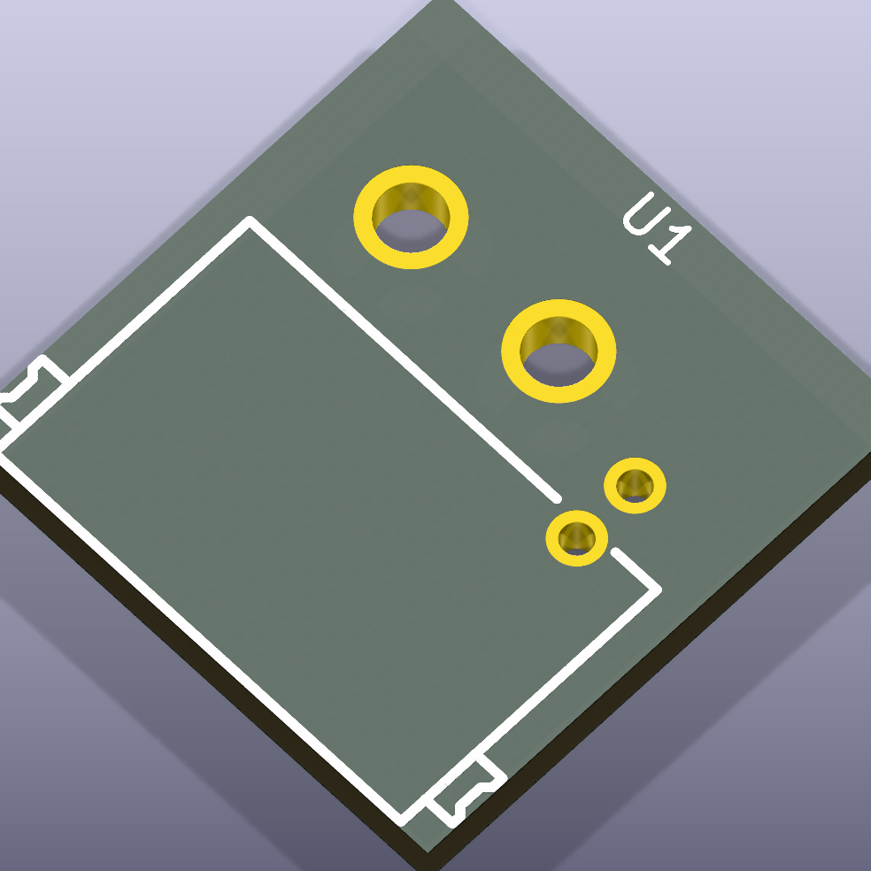

# connectors

Various connectors

## Package Information

- Version: 0.1.0
- Total Modules: 5
- Author(s): Ruben Iteng
- License: MIT
- Homepage: https://github.com/ruben-iteng/ato-library

## Available Modules

### Module List

| Image | Module | Description |
|-------|--------|-------------|
|| screw_terminal_3_81mm_2p | - |
|| screw_terminal_3_81mm_3p | - |
|| screw_terminal_3_81mm_4p | - |
|| screw_terminal_3_81mm_5p | - |
|| addressable_led_connector | - |
