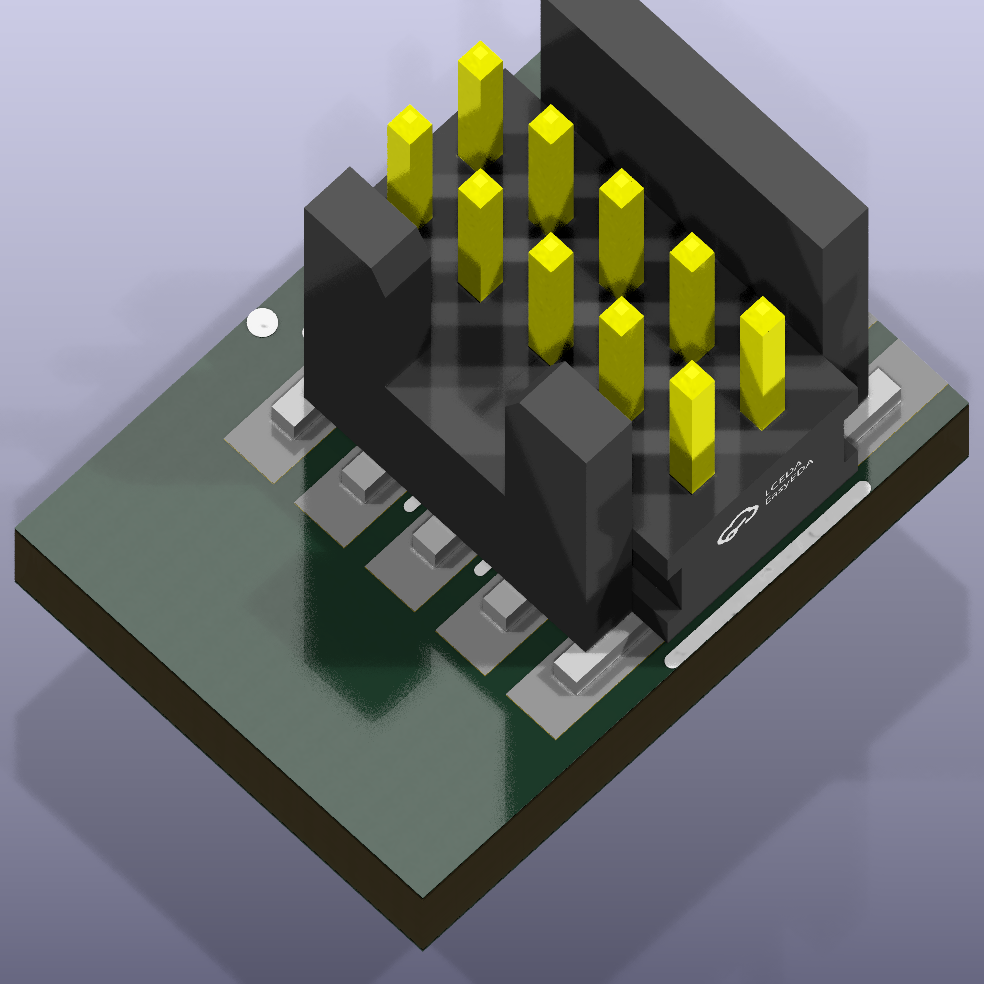

# debug-interfaces

SWD and tag connect headers for programming and debugging

## Package Information

- Version: 0.1.0
- Total Modules: 3
- Author(s): Ruben Iteng
- License: MIT
- Homepage: https://github.com/ruben-iteng/ato-library

## Available Modules

### Module List

| Image | Module | Description |
|-------|--------|-------------|
|| arm_cortex_m_debug_header | 10 pin debug header with SWD pinout according to ARM Cortex M debug specification     https://documentation-service.arm.com/static/5fce6c49e167456a35b36af1 |
|| swd_tc2030_idc_nl | Tag-Connect TC2030-IDC-NL (6-pin) landing pattern with SWD pinout |
|| swd_tc2030_idc_fp | Tag-Connect TC2030-IDC-FP (6-pin) landing pattern with SWD pinout |
