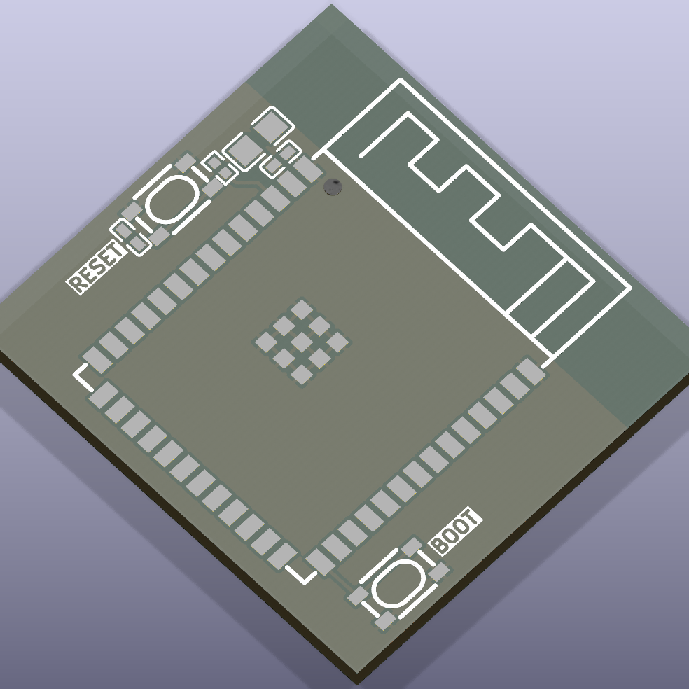

# esp32s3

ESP32 S3 microcontroller

## Package Information

- Version: 0.1.0
- Total Modules: 1
- Author(s): Ruben Iteng
- License: MIT
- Homepage: https://github.com/ruben-iteng/ato-library

## Available Modules

### Module List

| Image | Module | Description |
|-------|--------|-------------|
|| esp32_s3_wroom_reference_design | ESP32 S3 WROOM-1 module with build-in antenna and supporting components     - 32MB flash     - 2MB PSRAM |
