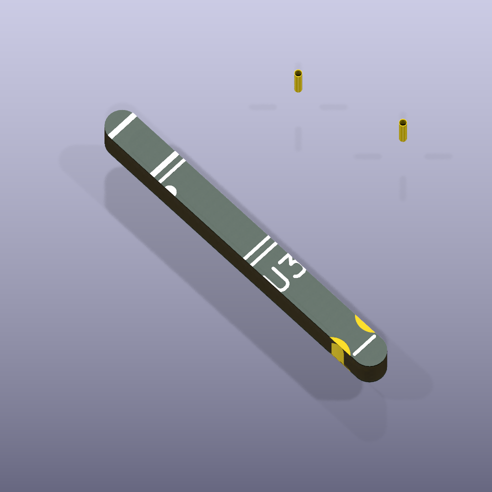

# ina228

INA228 low voltage power monitor with I2C interface

## Package Information

- Version: 0.1.0
- Total Modules: 1
- Author(s): Ruben Iteng
- License: MIT
- Homepage: https://github.com/ruben-iteng/ato-library

## Available Modules

### Module List

| Image | Module | Description |
|-------|--------|-------------|
|| isolated_ina228 | INA228 with I2C and power isolation. |
