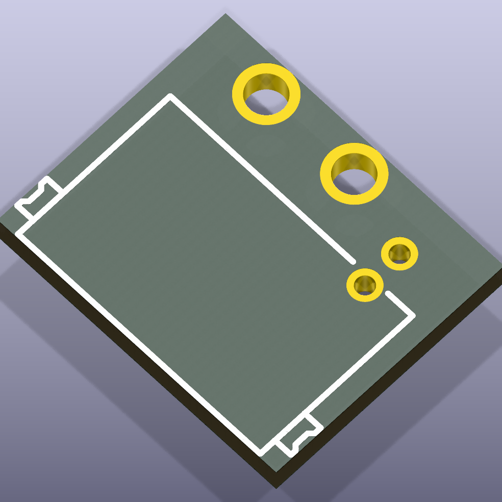

# leds

Various LED components and modules

## Package Information

- Version: 0.1.0
- Total Modules: 1
- Author(s): Ruben Baldewsing
- License: MIT
- Homepage: https://github.com/ruben-iteng/ato-library

## Available Modules

### Module List

| Image | Module | Description |
|-------|--------|-------------|
|| addressable_led_connector | - |
